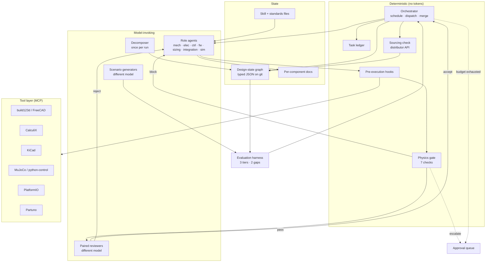

# 02 — Architecture Specification

**Status:** draft 1
**Owner:** Yasin Hessnawi
**Companion:** thesis chapter `Architecture`, which carries the justification. This document carries the implementable detail and is executable without it.
**Convention:** every decision carries an ID `ARCH-nnn`, its dependencies, a cadence, and an acceptance test. Nothing in this document is advice. If an item cannot be executed as written, it is a defect in the item.

---

## S0. Conventions

| Field | Meaning |
|---|---|
| **Decision** | What is built. Imperative, no hedging. |
| **Depends on** | IDs that must exist first. `—` means no dependency. |
| **Cadence** | `once`, `per subtask`, `per module`, `per run`, `weekly`, `on change`. |
| **Acceptance** | The observable that proves it works. |
| **Defer** | Present only where the item is deferred past the first slice. |

**Blocking vs warning.** A *block* halts the pipeline and returns to the producing role. A *warning* is written to the graph and surfaced at the next gate up. No check is advisory.

**Model separation rule.** Three roles must not share a model instance with the implementer: the reviewer, the held-out scenario generator, the validation scenario generator. Enforced at dispatch, not by convention.

---

## S1. Principles

### ARCH-001 — Orchestrator interface and first-slice binding
**Decision.** The orchestrator implements one interface: read the ledger and the graph, emit the next action, emit the merge decision. Two bindings exist. The **deterministic** binding is Python, calls a model exactly once per run at decomposition, and spends zero tokens on scheduling, dispatch, merge or reconciliation. The **model-in-loop** binding makes those same decisions with a model reading the ledger and graph at each step. Gate ordering, hook enforcement and reviewer invocation live outside the interface in both bindings and cannot be skipped by either.

The deterministic binding is the first slice. The model-in-loop binding is a deferred ablation (ARCH-140, ARCH-152).
**Depends on.** —
**Cadence.** once
**Acceptance.** Deterministic binding: token accounting for a full run shows zero tokens attributable to routing decisions. Both bindings: a run cannot reach merge without a gate result and a review result in the ledger.

### ARCH-002 — State outside context
**Decision.** No fact required after the current subtask lives only in an agent's context. The design-state graph, the task ledger and the specifications are files. Agents re-read rather than remember.
**Depends on.** ARCH-010, ARCH-012
**Cadence.** per subtask
**Acceptance.** Killing an agent session mid-task and restarting it loses no project state.

### ARCH-003 — Enforce, do not request
**Decision.** Any constraint expressible as a deterministic check moves from the prompt into a pre-execution hook.
**Depends on.** ARCH-090
**Cadence.** on change
**Acceptance.** Every constraint in every standards file is either hook-enforced or explicitly listed as judgement-only in S9.

### ARCH-004 — Physics gates, does not advise
**Decision.** The physics layer blocks. It runs before the reviewer, not after.
**Depends on.** ARCH-080
**Cadence.** per subtask, per module, per run
**Acceptance.** A deliberately unit-inconsistent artefact never reaches a reviewer.

---

## S2. Component structure



### ARCH-005 — Session isolation
**Decision.** Every agent session runs in its own git worktree. One agent writes one module. The orchestrator owns merge.
**Depends on.** ARCH-001
**Cadence.** per subtask
**Acceptance.** Two concurrent sessions cannot produce a merge conflict on the same file.

---

## S3. Design-state graph

### ARCH-010 — Graph schema
**Decision.** JSON, one file per node, committed. Minimum node shape:

```json
{
  "id": "motor.left",
  "kind": "component | module | requirement | interface",
  "domain": "mechanical | electrical | control | firmware | cross",
  "owner_role": "electrical",
  "quantities": {
    "stall_current": {"value": 2.4, "unit": "A", "source": "datasheet", "written_by": "sizing"}
  },
  "requirements": ["REQ-014"],
  "constrains": ["power.budget", "control.loop_gain", "chassis.mount"],
  "model": "path/to/executable_model.py",
  "geometry_hash": "sha256:...",
  "updated": "2026-09-18T10:02:11Z"
}
```

**Depends on.** —
**Cadence.** on change
**Acceptance.** Every numeric quantity in the graph has a unit string. A node with a bare number fails schema validation.

### ARCH-011 — Interface contracts precede implementation
**Decision.** The orchestrator writes every `interface` node at decomposition. A producing agent may read it and may not write it. A hook rejects any commit that modifies an interface node from inside a module worktree.
**Depends on.** ARCH-010, ARCH-090
**Cadence.** once per module, then immutable
**Acceptance.** An agent instructed to relax its own interface fails at the hook, not at review.

### ARCH-012 — Task ledger
**Decision.** Append-only JSONL. One line per subtask with id, spec path, assigned role, attempt count, gate result, review result, merge commit.
**Depends on.** —
**Cadence.** per subtask
**Acceptance.** Ledger length equals the number of dispatched subtasks. A skipped task is visible as a missing id, not as an absence.

### ARCH-013 — Divergence detection
**Decision.** Diff the graph after every step. Any node written by a role that does not own it is a blocking failure.
**Depends on.** ARCH-010, ARCH-012
**Cadence.** per subtask
**Acceptance.** Injected cross-role write is caught within one step.

---

## S4. Specifications and reading

### ARCH-020 — Mandatory reading hook
**Decision.** A session-start hook lists required files and refuses all tool calls until each has been read in that session. Required set: role standards file, module specification, role skill file, interface contracts touching the module.
**Depends on.** ARCH-090
**Cadence.** per subtask
**Acceptance.** A session that skips a required read cannot make a tool call.

### ARCH-021 — Research phase, switchable
**Decision.** Triggered when a specification names a component or standard absent from the knowledge layer. Findings written to the component document under `## Research`. Flag `--research=on|off|observe`.
**Depends on.** ARCH-020, ARCH-140
**Cadence.** per subtask
**Acceptance.** Running the same brief with the flag off changes only research behaviour, and the delta is attributable.

### ARCH-022 — Specification contents
**Decision.** Every spec file carries: component id, position in decomposition, requirements with success criteria, interface contracts, ordered task list, assigned roles, required reading, deferral markers.
**Depends on.** ARCH-010
**Cadence.** once per module
**Acceptance.** A coding agent handed only the spec and its required reading can begin without asking a question.

### ARCH-023 — Context split
**Decision.** Always loaded: standards file, module spec, role skill file. Retrieved on demand: datasheets, standard clauses, prior close-out summaries.
**Depends on.** ARCH-020
**Cadence.** per subtask
**Acceptance.** Always-loaded set stays under an agreed token ceiling per role; breaching it is a defect in the standards file, not a reason to raise the ceiling.

---

## S5. Control loop

### ARCH-030 — Loop stages and repair budget
**Decision.** Eight stages, in order: resolve task → spawn worktree session → verify reading → implement under hooks → physics gate → paired review on full trajectory → accept and merge, or reject with repair instruction → diff ledger and graph.
Repair budget is **three attempts**. Attempt 1 rejection returns the finding. Attempt 2 returns finding plus failing check and numeric output. Attempt 3 escalates to the human with all three trajectories attached.
**Depends on.** ARCH-005, ARCH-020, ARCH-080, ARCH-060
**Cadence.** per subtask
**Acceptance.** No subtask consumes more than three implementation attempts without appearing in the approval queue.

### ARCH-031 — Gate ordering
**Decision.** Physics gate runs before review. Rejected work is never reviewed.
**Depends on.** ARCH-080
**Cadence.** per subtask
**Acceptance.** Review token spend on gate-failed artefacts is zero.

---

## S6. Roles

### ARCH-050 — Domain role definitions

| Role | Owns | Tools | Skill file contains | Reviewed against | Hands off to | First slice |
|---|---|---|---|---|---|---|
| Design | Concept, decomposition, trade-offs | graph, requirement templates | decomposition patterns, abstraction levels, requirement phrasing | requirement coverage, traceability | all | automated |
| Mechanical | Geometry, sizing, mounting, DFM | build123d MCP, CalculiX, TraceParts | material table, fastener rules, wall-thickness and radius minima, DFM checklist | geometric validity, sizing margin, DFM pass | sizing, integration, manufacturing | generated, **human sign-off on sizing** |
| Electrical | Component selection, power budget, wiring, connectors | Partuno, KiCad MCP, datasheets | connector conventions, derating rules, power-budget template | schematic DRC clean, budget closes, parts sourceable | sizing, firmware, integration | automated |
| Control | Plant model, controller, stability | python-control, MuJoCo, Simscape | plant-model templates, PID and LQR selection rules, margin thresholds | closed-loop stable in sim, margins met | sizing, firmware, simulation | automated, **human sign-off on stability margin** |
| Firmware | Drivers, real-time loop, HAL, on-target test | PlatformIO, Arduino CLI, HIL rig | timing budget rules, HAL conventions, driver patterns | compiles, timing budget met, on-target test passes | integration | automated |

**Depends on.** ARCH-010, ARCH-020
**Cadence.** per module
**Acceptance.** Each role's skill file exists and is non-empty before that role is ever dispatched.

### ARCH-051 — Cross-cutting roles

| Role | Owns | Type | First slice |
|---|---|---|---|
| Sizing | Every quantity constraining more than one domain | agent | automated, exclusive write |
| Integration | Interface satisfaction, end-to-end behaviour, completion declaration | agent | automated |
| Simulation | Validation environment, scenario tiers | agent | automated |
| Requirements | Spec authoring below module level | agent | automated |
| Manufacturing docs | Drawings, tolerances, PMI | agent | **deferred**, restricted subset only |
| Sourcing | BOM validation against real availability | **deterministic step, not an agent** | automated |
| Knowledge curation | Skill and standards files | **human** | human |
| Red team | Adversarial attack on the design | agent | **deferred** |

**Depends on.** ARCH-050
**Cadence.** per run
**Acceptance.** No quantity marked `cross` in the graph is written by a role other than `sizing`.

### ARCH-040 — Arbitration rule
**Decision.** Fixed precedence, no negotiation. Physics gate outranks every domain. Sizing outranks any single domain on a shared quantity. Unresolved after both → approval queue with both positions and the disputed edges.
**Depends on.** ARCH-051, ARCH-130
**Cadence.** on conflict
**Acceptance.** No conflict resolution path involves two agents exchanging messages.

---

## S7. Reviewer topology

### ARCH-060 — Paired specialist reviewers
**Decision.** Each producing role has a paired reviewer with its own rubric and knowledge file, running a different model. Reviewer reads the **full trajectory**, not only the artefact.
**Depends on.** ARCH-050
**Cadence.** per subtask
**Acceptance.** Dispatch refuses to run a reviewer on the same model string as the implementer.

### ARCH-061 — Implementation order
**Decision.** Control and firmware reviewers first, since those roles are automated first. Mechanical reviewer third. Others follow their roles.
**Depends on.** ARCH-060
**Cadence.** once
**Acceptance.** Every automated role has a paired reviewer before it is dispatched unsupervised.

### ARCH-062 — Rubric contents
**Decision.** Each rubric lists: acceptance criteria from the spec, the domain's standard violations, the known antipatterns from the skill file, and an explicit instruction to report reward-hacking indicators (feature isolation, hard-coded values, disabled checks).
**Depends on.** ARCH-060, ARCH-100
**Cadence.** on change
**Acceptance.** Rubrics are versioned; a rubric change is a ledger event.

### ARCH-063 — Maintenance cost, stated
**Decision.** Each pair adds one rubric file and one knowledge file to maintain, and roughly doubles review token spend against a single generalist reviewer. Accepted because reviewer drift toward one issue class is a known failure and because a generalist cannot carry five domains of standards within the context budget.
**Depends on.** ARCH-060
**Cadence.** —
**Acceptance.** Cost recorded per run so the trade is visible rather than assumed.

---

## S8. Physics layer

### ARCH-080 — Mandatory checklist

| # | Check | Tool | Runs at | Returns | On failure |
|---|---|---|---|---|---|
| 1 | Unit consistency | `pint` | subtask | offending expression, both unit sides | **block** |
| 2 | Magnitude plausibility | bounds table in skill file | subtask | value, expected range, source of range | **block** |
| 3 | Static equilibrium and load path | closed form, CalculiX | module | reaction forces, unbalanced residual | **block** |
| 4 | Power balance | `sympy` + graph arithmetic | module, system | deficit in W, contributing nodes | **block** |
| 5 | Energy and mass conservation | `sympy` | module | imbalance, terms | **block** |
| 6 | Thermal budget | graph arithmetic | module, system | margin in K or W | warn at module, **block** at integration |
| 7 | Cross-domain propagation | graph traversal | system | list of unwritten constrained edges | **block** |

**Depends on.** ARCH-010, ARCH-004
**Cadence.** per subtask (1–2), per module (3–6), per run (4, 6, 7)
**Acceptance.** Each check has a unit test with a deliberately failing input and a deliberately passing input.

### ARCH-081 — Gate is not editable by agents
**Decision.** The gate directory is protected by a pre-execution hook. No agent session may write to it.
**Depends on.** ARCH-090
**Cadence.** per subtask
**Acceptance.** An agent instructed to modify the gate fails at the hook.

### ARCH-082 — Propagation check definition
**Decision.** For any node whose quantities changed, traverse `constrains`. For each target, if no quantity on that target was rewritten in the same commit and no explicit `no_change_justified` annotation exists, fail.
**Depends on.** ARCH-010, ARCH-080
**Cadence.** per run
**Acceptance.** Swapping a motor for one with different stall current, without touching current budget, loop gain or mount inertia, fails the check.

### ARCH-083 — Catch accounting
**Decision.** Every gate event logs: check number, value, node, module, and `reviewer_had_passed: true|false`. The headline research quantity is the count of physical errors caught where `reviewer_had_passed` is true.
**Depends on.** ARCH-080, ARCH-060
**Cadence.** per subtask, aggregated weekly
**Acceptance.** The quantity is queryable from the ledger in week one. **If it trends to zero, the contribution is weaker than claimed and the thesis reports that.**

---

## S9. Hook enforcement

### ARCH-090 — Enforced surface

| Constraint | Hook point | Enforceable |
|---|---|---|
| Protected paths (gate dir, interface nodes, `.env`) | PreToolUse | yes |
| Unit consistency on committed expressions | PreToolUse | yes |
| Mandatory reading complete | SessionStart | yes |
| Forbidden git operations (force push, `--no-verify`) | PreToolUse | yes |
| Cross-role graph write | PreToolUse | yes |
| Schema validity of graph writes | PreToolUse | yes |
| Correctness of engineering judgement | — | **no, reviewer + gate** |

**Depends on.** ARCH-003
**Cadence.** per tool call
**Acceptance.** Each row has a test. **Known hazard:** file writes issued through a shell can bypass a write hook, so shell invocation is itself hooked and the bypass path is tested explicitly.

---

## S10. Knowledge and skills

### ARCH-100 — Human-gated skill promotion
**Decision.** Successful episodes emit candidate skills, failures emit candidate antipatterns, both to `staging/`. Nothing enters the retrievable library without human promotion.
**Depends on.** ARCH-050
**Cadence.** per subtask (emit), weekly (promote)
**Acceptance.** Library contents are a strict subset of promoted items.
**Defer.** Automatic promotion is a later phase, contingent on staging data showing promoted skills raise measured pass rate.

### ARCH-101 — Standards files
**Decision.** One per domain, human-authored, read before any work in that domain. Contains the rules that apply to every task, not to one.
**Depends on.** ARCH-020
**Cadence.** on change
**Acceptance.** Every automated role has a standards file before first dispatch.

---

## S11. Manufacturing output

### ARCH-110 — Restricted generation scope
**Decision.** Generate: standard views, dimension scheme, a rule-checkable GD&T subset (datum from largest planar face, position tolerance on holes), ISO 286 fit selection from functional tags on the graph, STEP AP242 with semantic PMI. Check each with a deterministic syntax and completeness validator. **Human sign-off required on every drawing.**
**Depends on.** ARCH-010, ARCH-051
**Cadence.** per component
**Acceptance.** A generated drawing passes the validator and a machinist can produce the part from it.
**Defer.** General tolerancing from functional intent. No measured automation exists for it.

### ARCH-111 — Staleness by hash
**Decision.** Record `geometry_hash` when a drawing is produced. Compare on every graph change. Mismatch marks the drawing stale and regenerates. Never patch.
**Depends on.** ARCH-010, ARCH-110
**Cadence.** on change
**Acceptance.** Changing a dimension invalidates the drawing within one step.

### ARCH-112 — Assembly manual
**Decision.** Assembled from per-component close-out documents, BOM and wiring definition. Validation is the physical build by mechatronics students working from the manual alone.
**Depends on.** ARCH-110, ARCH-120
**Cadence.** per run
**Acceptance.** Students complete the build without consulting the design team. Failures are logged as manual defects, not build defects.

---

## S12. Buildability

### ARCH-120 — BOM validation
**Decision.** Every line validated for availability, unit price, MOQ, order multiple and **lead time to Norway**. Any failure returns the line to the electrical role as blocking. Norway sits outside the EU customs union, so VAT and customs handling apply to non-EEA imports and are recorded per line.
**Depends on.** ARCH-051
**Cadence.** per run
**Acceptance.** Every BOM line is purchasable and deliverable inside the project timeline, or the design changes.

### ARCH-121 — No autonomous purchasing
**Decision.** The sourcing tool may query and may not order.
**Depends on.** ARCH-120
**Cadence.** —
**Acceptance.** No order-placing capability is exposed to any agent.

---

## S13. Human oversight

### ARCH-130 — Approval queue item
**Decision.** One queue, three sources: gate escalation, exhausted repair budget, unresolved arbitration. Plus standing sign-off on mechanical sizing, control stability margin and every drawing.
Each item carries: decision required, artefact diff, triggering finding, the three most relevant quantities, link to full trajectory.
**Depends on.** ARCH-030, ARCH-040
**Cadence.** as raised
**Acceptance.** Median review time under one minute. **Items that cannot be compressed to that indicate the decomposition is too coarse and are logged as such.**

### ARCH-131 — Escalation decision interface
**Decision.** The question "does this subtask go to the approval queue" is asked through one interface, `decide(question, state) -> (answer, confidence, backend_id, latency_ms)`. Question kinds are `yes_no`, `choice` and `score`; only `yes_no` is exercised in the first slice. `state` is the structured subtask record at the end of an attempt — the ledger line, the gate result, the reviewer verdict, the changed-node summary. No free text in the first slice.

A confidence **below 0.8 routes to ARCH-130 whatever the answer**. The threshold is a property of the interface, not of a backend, so every backend is judged on the same routing rule.

The default binding is `rules`: exactly the deterministic conditions ARCH-030 and ARCH-040 already specify, emitted at confidence 1.0. Every other binding is an ablation arm and enters only through ARCH-132.

**Relationship to ARCH-001.** A binding is admissible only if it spends **zero tokens on the decision** and its weights or rules are frozen at a recorded version. This is a deliberate and bounded carve-out from the invariant: ARCH-001 forbids a model deciding *what runs next and whether to merge*, because such a model can be argued out of routing and there is no downstream check on it. Escalation is a different decision with an asymmetric failure mode — over-escalating costs a minute of human attention, under-escalating is still caught by the physics gate and the reviewer, both of which run regardless. The carve-out does not extend to scheduling, dispatch, merge or reconciliation, and no backend may read or write the design-state graph.

**Depends on.** ARCH-030, ARCH-040, ARCH-130
**Cadence.** per subtask, at the end of an attempt
**Acceptance.** With the `rules` binding the approval queue receives exactly the items it receives with no interface at all, proven by a test that runs both. Every call records answer, confidence, backend id and latency in the ledger, so a backend's behaviour is auditable after the fact rather than at the time.

### ARCH-132 — Escalation backend register
**Decision.** Bindings enter by name, with a status and an entry condition. A backend enters only on a pre-registered experiment's pass, and its row cites that run.

| Backend | Status | Entry condition and evidence |
|---|---|---|
| `rules` | **ships**, the default | none; it is ARCH-030 and ARCH-040 expressed through the interface |
| `llm` | ships as an **ablation arm, off by default** | costs a model call per decision, so it is priced and logged and can never be the default |
| `tsetlin` | **contingent, parked** | R-TM-01, four runs. Calibrated humility off-distribution held in every run and no baseline reproduced it; accuracy parity did not, and clause legibility failed twice. Carries a provenance caveat: the selected region was first seen in an earlier run's post-hoc frontier |
| `laya` | **contingent, under test** | R-LAYA-01 |

**Depends on.** ARCH-131, ARCH-140
**Cadence.** on change
**Acceptance.** Only `rules` is enabled by default. Every other binding is an independent flag under ARCH-140 and every flag combination runs to completion. A row whose experiment has not passed reads *contingent*, and the system refuses to enable it outside an ablation run.

---

## S14. Evaluation

### ARCH-140 — Ablation switches
**Decision.** Independent flags, each disableable without the others: research phase, physics gate (`on|off|observe`), paired reviewers, skill library, hook enforcement, prompt optimiser, orchestrator (`deterministic|model-in-loop`).

**Orchestrator variants.** The deterministic variant is the first slice and is built first, since the evidence favours it and it is testable against injected errors before any agent exists. The model-in-loop variant is a deferred ablation: same graph, same ledger, same hooks, same gate ordering, but scheduling, dispatch and merge decisions are made by a model reading the ledger and graph at each step rather than by code. It must not be able to skip the physics gate or the reviewer, so gate ordering stays in code in both variants. What varies is only who decides what runs next and whether to merge.

**Depends on.** all of S1–S10
**Cadence.** per run
**Acceptance.** Every flag combination runs to completion.
**Priority.** The physics gate in `observe` mode is the most important single ablation, since ARCH-083 is only interpretable against a run where the gate watches without blocking. The orchestrator ablation is the second most important, because no study has measured deterministic against model-driven coordination on a design task whose artefact is physical. It is run only if time allows after the first slice is complete and measured.

### ARCH-141 — Three scenario tiers

| Tier | Seen by | Purpose | Regenerated when |
|---|---|---|---|
| Visible | implementer | iteration during a subtask | requirements change |
| Validation | **prompt optimiser only** | optimisation objective | requirements change |
| Held out | **nothing until measurement** | both reported gaps | ever exposed |

All three generated by a model different from the implementer. All three **compose requirements** rather than test them singly, since feature isolation alone produces a gap without tampering.
**Depends on.** ARCH-051
**Cadence.** per run
**Acceptance.** Held-out set is never read by an implementer or an optimiser. Exposure triggers regeneration, logged.

### ARCH-142 — Two headline gaps, weekly from week one
**Decision.**
- **Reward-hacking gap** = visible pass rate − held-out pass rate. Measures satisfying the proxy rather than the requirement.
- **Optimiser-overfit gap** = validation pass rate − held-out pass rate. Measures whether the optimiser has begun climbing the evaluation.

A rising second gap triggers regeneration of the validation tier. It is not a success signal.
**Depends on.** ARCH-141
**Cadence.** weekly
**Acceptance.** Both numbers exist in week one, from however few tasks exist then.

### ARCH-143 — Baseline
**Decision.** Raw coding agent, same brief, same tools, same token budget. No harness, no gate, no reviewer, no spec structure.
**Depends on.** —
**Cadence.** per milestone
**Acceptance.** Baseline is re-run whenever the task set changes, so the comparison never drifts.

### ARCH-144 — Prompt optimisation scope
**Decision.** Optimises exactly three things: the decomposition prompt, the specification-authoring prompt, the reviewer rubrics. Objective is the **validation tier**. Feedback signal is the reviewer's textual findings, not a scalar.
**Depends on.** ARCH-141, ARCH-140
**Cadence.** per milestone
**Acceptance.** No weights change. No held-out scenario is read.
**Defer.** Entire item is deferred past the first slice.

### ARCH-145 — Observability
**Decision.** Per-step traces, per-check results, token and wall-clock per session, pinned model version strings, seeds, resolved configs, artefact hashes.

Record, per run, the variance in task ordering and merge decisions across repeated runs with the same seed and brief. This is the reproducibility axis the COBOL comparison used, and it is the primary measurement for the orchestrator ablation.

**Depends on.** ARCH-012
**Cadence.** per subtask; ordering variance per run
**Acceptance.** Any run is reproducible from its recorded configuration. Ordering variance is a queryable number for every run, not only for ablation runs.

---

## S15. Cost and build order

### ARCH-150 — Cost model
**Decision.** Budget three parallel sessions, repair budget three, reviewer reading trajectories. Reductions taken: cache standards and skill files across sessions; run the gate before the reviewer so rejected work is never reviewed; reserve deep research for components absent from the knowledge layer.
**Not taken:** cutting trajectory reading. Detection AUC falls 0.97 → 0.92 and TPR at 5% FPR falls 0.82 → 0.44 without it.
**Depends on.** ARCH-031, ARCH-060
**Cadence.** per run
**Acceptance.** Cost per full run recorded and trended.

### ARCH-151 — Build order

| Order | Component | Why here |
|---|---|---|
| 1 | Design-state graph, task ledger | nothing is testable without them |
| 2 | Deterministic orchestrator, hook layer | the enforcement substrate |
| 3 | **Physics gate** | it is the contribution, and testable against injected errors before any agent exists |
| 4 | Two domain roles + paired reviewers | control and firmware, the strongest domains |
| 5 | Evaluation harness, three tiers | in practice alongside 4 |
| 6 | Sizing role, integration role | the unowned roles |
| 7 | Remaining domain roles | |
| 8 | Manufacturing docs (restricted), sourcing | |

**Depends on.** —
**Cadence.** once
**Acceptance.** Minimum runnable slice is orders 1–5: a decomposed brief, two roles implementing under hooks and gate, reviewed, measured.

### ARCH-152 — Deferral register

| Deferred | Attaches to | Redesign needed |
|---|---|---|
| Manufacturing docs beyond restricted subset | ARCH-110 | no |
| Red-team role | ARCH-051 | no |
| Automatic skill promotion | ARCH-100 | no |
| Prompt optimisation | ARCH-144 | no |
| Three of five domain roles | ARCH-050 | no |
| Model-in-loop orchestrator variant | ARCH-001, ARCH-140 | no. The orchestrator interface (read ledger and graph, emit next action, emit merge decision) is the same for both. |
| Physical build | ARCH-112, ARCH-141 | no. **Stretch goal for December**, conditional on the first slice being measured by mid-November and parts ordered by then. Three external dependencies: parts arriving in Norway, students available, simulation passing first. The semester's terminal check is the held-out simulation tier, not the build. |
| Sim-to-real measurement | ARCH-112 | no. Thesis phase. Friction is the dominant unmodelled term. No kill criterion this semester. |

**Every deferral attaches to an interface that exists in the first slice.** None requires redesign to add.

---

## S16. Rejected alternatives

| Rejected | Reason |
|---|---|
| Orchestrator as an agent | Controlled ablation localises the advantage to deterministic enforcement, not richer specification. A model that routes can be talked out of routing. |
| Single agent holding every tool | Context budget cannot carry five domains of standards. Context rot makes the failure silent rather than loud. |
| Fine-tuned domain models | Compute. Prompt-level optimisation reaches comparable gains in hundreds of rollouts where weight-level methods need tens of thousands, decisive when one score costs a simulation. |
| Two-tier evaluation (visible + held out) | The optimiser climbs whatever score it is given. Any set used as its objective stops being held out the moment optimisation starts. |
| Agent-to-agent negotiation for conflicts | No termination guarantee, no audit trail. |
